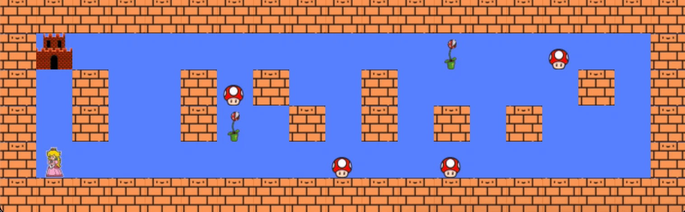

<h1 align="center">So Long</h1>
<p align="center">
	
</p>
<div align="center">
	
</div>

- [Description](#description)
- [Structure du projet](#structure-du-projet)
- [Utilisation de so_long](#utilisation-de-so_long)
	- [Pré-requis](#pre-requis)
	- [Compilation du projet](#compilation-du-projet)
	- [Exécution du projet](#exécution-du-projet)

## Description

Le but de ce projet est de développer un jeu 2D simple où un joueur doit collecter tous les items présents sur la carte, puis s’échapper en empruntant le chemin le plus court possible.

Pour cela, il faut intégrer des textures, des sprites et quelques autres éléments tels que la gestion de la fenêtre, la gestion des événements, etc.

Pour le côté graphique, ce sera l'occasion d'apprendre à intégrer une bibliothèque externe dans un projet. Pour cela, il faut utiliser la MiniLibX, qui est la bibliothèque graphique de l’école 42.

Les bonus réalisés ici sont, le changement de visuel du personnage selon sa direction et l'ajout des ennemies

## Structure du projet
```tree
├── assets
├── game
├── include
├── map
├── mlx
├── parsing
└── utils
```

- assets : textures et sprites
- map : les cartes disponibles
- include, utils et get_next_line : fonctions nécessaires au projet
- mlx : bibliothèque graphique de l’école 42
- parsing : fonctions de traitement et de vérification des inputs et des cartes de jeu
- game : fonctions de gestion du jeu

## Utilisation de so_long

### Pre-requis

* **compilateur `gcc`**

### Compilation du projet
```shell
make
```
### Exécution du projet

```shell
./so_long map/*/*
```
_Les maps sont triées par validité, et les valides sont de différentes tailles._
```

## Ressources utiles
[  Documentation MiniLibX ](https://harm-smits.github.io/42docs/libs/minilibx/getting_started.html)

## Testeur
Aucun